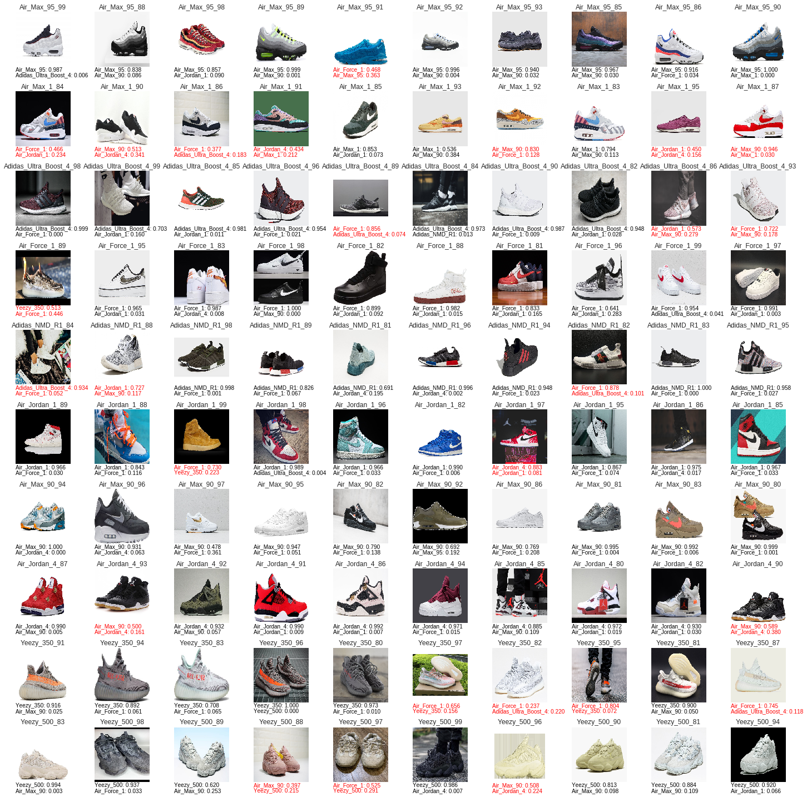
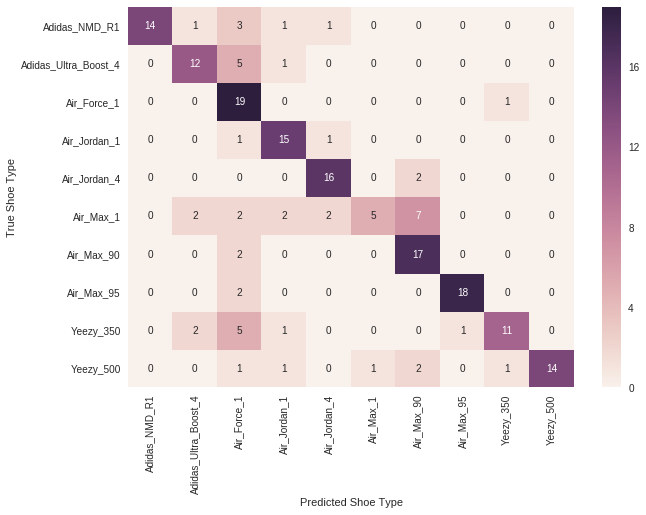
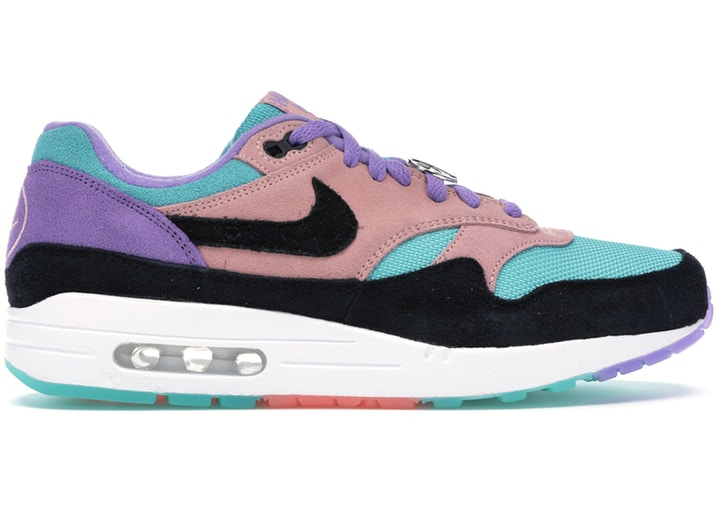
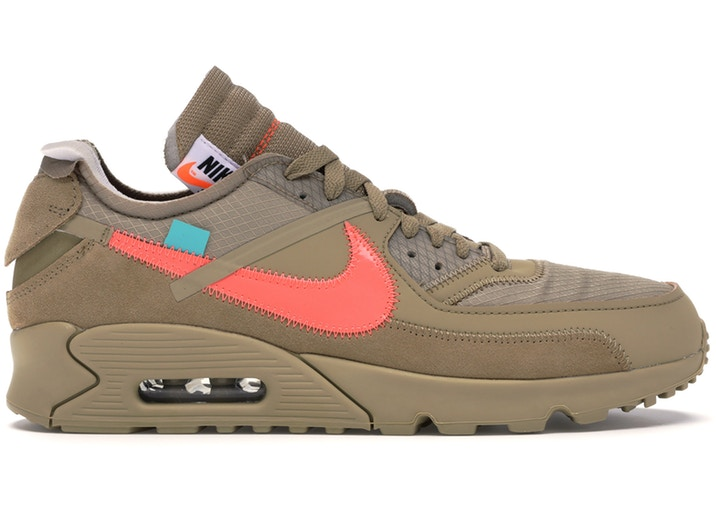

# Sneaker_Classifier
In this project, I crawled images of 10 types of sneakers from Google search pages. The [SneakerDataset](https://drive.google.com/drive/folders/1EOROtXHeroQuaXe81oUmvjj575DnNo3c?usp=sharing) consists of around 1000 shoe images and there are about 80 training images and 20 test images for each type of shoe. All images in training set and test set have already been separated into different folders based on their classes and can be loaded directly by .flow_from_directory(directory) in Keras. 

I used transfer learning to fine tune 3 models including ResNet50, VGG16 and InceptionV3 that have been pretrained on [ImageNet](http://www.image-net.org/) to classify the types of different sneakers.

Results showed that fine tuned VGG16 with an average pooling layer, a size-64 fully connected layer with ReLU activation and 10-way softmax layer added had the best performance with top-1 accuracy 0.73 and top-3 accuracy 0.90 on the test set. Batch normalization was used to speed up convergence.

[SneakerDataset](https://drive.google.com/drive/folders/1EOROtXHeroQuaXe81oUmvjj575DnNo3c?usp=sharing) have been shared and anyone is allowed to use it for learning or teaching purposes.

More details about this projects are described in [Sneaker_Classifier.ipynb](Sneaker_Classifier.ipynb)
      
## Overview of [SneakerDataset](https://drive.google.com/drive/folders/1EOROtXHeroQuaXe81oUmvjj575DnNo3c?usp=sharing) 

|Sneaker Type           | Number of Training images   | Number of Test images  |
|-----------------------|-----------------------------|------------------------|
|Air_Max_90             |79                           |                     19 |
|Air_Max_95             |77                           |                     20 |
|Air_Jordan_4           |77                           |                     18 |
|Air_Max_1              |79                           |                     20 |
|Air_Jordan_1           |79                           |                     17 |
|Air_Force_1            |80                           |                     20 |
|Adidas_Ultra_Boost_4   |73                           |                     18 |
|Adidas_NMD_R1          |80                           |                     20 |
|Yeezy_350              |80                           |                     20 |
|Yeezy_500              |76                           |                     20 |

## Top-2 Prediction Results of fine tuned VGG16:

## Confusion Matrix:

Confusion matrix shows that Air Max 1 is very likely to be misclassified as Air Max 90. This is what I expected to see. To be honest, I couldn't tell the differences between them by myself and I included them in the dataset to make the classification more difficult on purpose.

Could you guess which one is Air Max 1 or Air Max 90? :)
 

